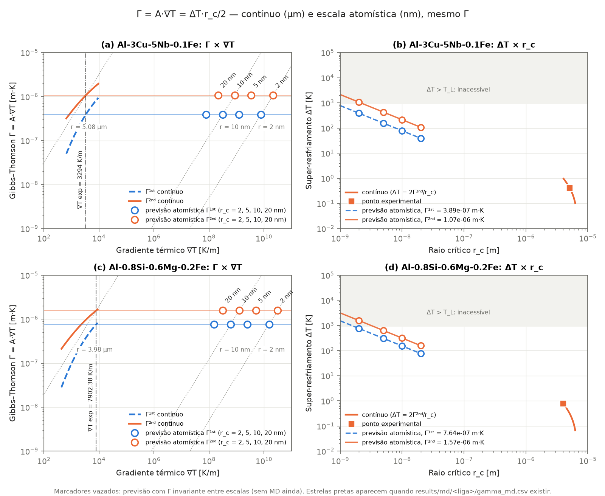
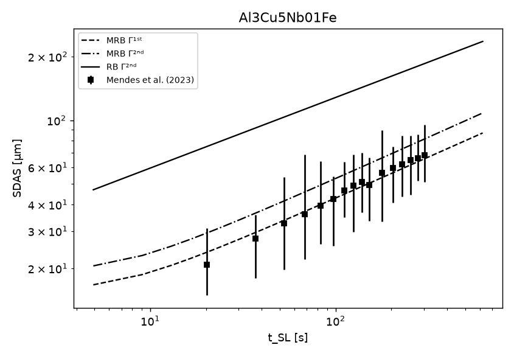
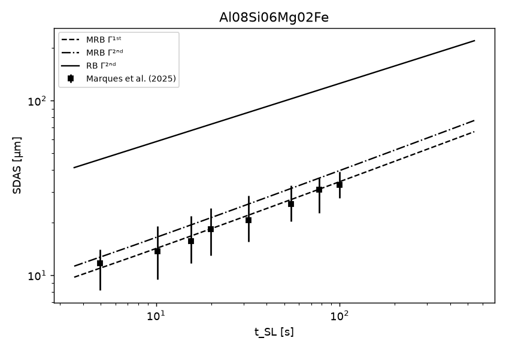

# Nucleation MD — modelo de nucleação de Ferreira (2024): contínuo × dinâmica molecular

[](LICENSE)


> *English summary:* atomistic (LAMMPS + PLUMED + GPUMD) and Python evaluation of the solid–liquid nucleation
> model of Ferreira (2024, *Physica B*, [doi:10.1016/j.physb.2024.416494](https://doi.org/10.1016/j.physb.2024.416494)),
> in which the thermal gradient displaces the Gibbs–Thomson equilibrium through the thermal-field tensor
> Γ = A·∇T. The goal is to compute the model quantities by molecular dynamics and validate the continuum solution
> for two Al alloys (Al-3Cu-5Nb-0.1Fe and Al-0.8Si-0.6Mg-0.2Fe). Documentation is in Portuguese.

Este repositório reúne o **pacote Python** que reproduz a solução do contínuo, as **entradas e análises de dinâmica
molecular** (MD) que calculam as mesmas grandezas na escala atômica, e os cálculos **CALPHAD** que dão as referências
termodinâmicas das ligas.

---

## Sumário

- [O modelo](#o-modelo)
- [Estado do projeto](#estado-do-projeto)
- [Resultados principais](#resultados-principais)
- [Início rápido (Python)](#início-rápido-python)
- [Reproduzir os resultados](#reproduzir-os-resultados)
- [Simulações de MD](#simulações-de-md)
- [Estrutura do repositório](#estrutura-do-repositório)
- [Documentação](#documentação)
- [Como citar](#como-citar)
- [Licença e conteúdo de terceiros](#licença-e-conteúdo-de-terceiros)

---

## O modelo

A energia livre de formação de um núcleo de raio $r$ sobre um substrato com ângulo de contato $\theta$ é

$$
\Delta G(r) = \left[\tfrac{1}{3}\pi r^3\,\Delta S_V\,\Delta T + \pi r^2\,\gamma_{SL}\right] f(\theta),
\qquad f(\theta) = 2 - 3\cos\theta + \cos^3\theta ,
$$

em que $\Delta S_V$, $\Delta T$, $\gamma_{SL}$ e $\theta$ **dependem de $r$**. A derivada é uma parábola em $r$,

$$
\frac{d\Delta G}{dr} = \frac{\pi r}{3}\left(a r^2 + 3 b r + 6\gamma_{SL} f\right),
$$

e dá dois raios críticos: $r_c^{1} = -2\gamma_{SL} f / b$ (1ª ordem) e $r_c^{2} = -3b/(2a)$ (2ª ordem).

O ponto central do modelo é o **tensor de campo térmico** (Gibbs–Thomson deslocado):

$$
\Gamma = A\,\nabla T, \qquad \Gamma^{1st} = \tfrac{1}{2}\,\Delta T\, r_c^{1}, \qquad \Gamma^{2nd} = \tfrac{1}{2}\,\Delta T\, r_c^{2},
\qquad A = 2\pi r_c^2 (1-\cos\theta).
$$

Só o gradiente térmico desloca o equilíbrio. No experimento transiente $\nabla T = \dot T / V_L$. A partir de Γ, o modelo
MRB prevê o espaçamento dendrítico secundário (SDAS), que concorda com os dados experimentais das duas ligas.

**Hipótese testada pela MD:** Γ vale nas duas escalas. Entre o contínuo (r_c ~ μm, ∇T ~ 10³ K/m) e a MD
(r_c ~ nm, ∇T ~ 10⁸–10¹⁰ K/m) mudam ∇T, ΔT e r_c, mas Γ = ΔT·r_c/2 = A·∇T deve se manter. O teste são núcleos
(*seeds*) sob ∇T imposto por NEMD, com r_c obtido por *seeding*.

<p align="center">
  
</p>

*Γ × ∇T (a, c) e ΔT × r_c (b, d): solução do contínuo e previsão na escala atômica com o mesmo Γ. Os marcadores vazados
serão substituídos pelos resultados de MD (`results/md/<liga>/gamma_md.csv`).*

## Estado do projeto

| Etapa | Estado | Onde |
|---|---|---|
| **E1** — pacote Python (CNT, Tolman, `FerreiraModel`, fontes do contínuo, SDAS) | ✅ concluída, 77 testes | [`nucleation_md/`](nucleation_md), [`tests/`](tests) |
| Verificação do contínuo (2 ligas) | ✅ desvio ≤ 1×10⁻⁵ | [`docs/CONTINUUM_VERIFICATION.md`](docs/CONTINUUM_VERIFICATION.md) |
| Cadeia ∇T → Γ → SDAS | ✅ reproduz os scripts originais | [`nucleation_md/sdas.py`](nucleation_md/sdas.py), [`results/sdas/`](results/sdas) |
| CALPHAD (Al-Nb e ligas completas) | ✅ | [`scripts/calphad_*.py`](scripts), [`results/calphad/`](results/calphad) |
| Instalação LAMMPS + PLUMED (CPU e CUDA) e GPUMD | ✅ | [`install/`](install) |
| **E2** — validação do potencial interatômico (Al) | ✅ Borovikov 2024 e NEP89; veredito pendente | [`md/e2_melting/`](md/e2_melting), [`md/e2_nep89/`](md/e2_nep89), [`md/e2_cfm_thick/`](md/e2_cfm_thick) |
| **E4** — *seeding* e NEMD (Γ = A·∇T) | ⏳ a iniciar | — |
| **E5** — substrato Al₃Nb, θ(r) | ⏳ | — |
| **E7** — PLUMED (Q6, clusters) e *forward flux sampling* | ⏳ (protocolo testado no *smoke test*) | [`install/smoke_test/`](install/smoke_test) |

## Resultados principais

### Contínuo (reproduzido pelo pacote)

| Liga | ∇T experimental | Γ¹ˢᵗ [m·K] | Γ²ⁿᵈ [m·K] | r_c² | ΔT |
|---|---|---|---|---|---|
| Al-3Cu-5Nb-0,1Fe (Mendes et al. 2023) | 3294 K/m | 3,887×10⁻⁷ | 1,0685×10⁻⁶ | 5,08 μm | 0,4206 K |
| Al-0,8Si-0,6Mg-0,2Fe (Marques et al. 2025) | 7902,38 K/m | 7,637×10⁻⁷ | 1,5745×10⁻⁶ | 3,98 μm | 0,7908 K |

<p align="center">
  
  
</p>

*SDAS × tempo local de solidificação t_SL. À esquerda, Al-3Cu-5Nb-0,1Fe (Mendes et al. 2023); à direita,
Al-0,8Si-0,6Mg-0,2Fe (Marques et al. 2025). Nas duas ligas o modelo MRB, com Γ¹ˢᵗ ou Γ²ⁿᵈ, fica dentro da dispersão
experimental, e o RB superestima o SDAS. Ajustes MRB: 7,67·t^0,377 e 9,38·t^0,379 μm (Al-Cu-Nb-Fe); 5,81·t^0,387 e
6,71·t^0,387 μm (Al-Si-Mg-Fe). Métricas em [`results/sdas/report_sdas.md`](results/sdas/report_sdas.md).*

### CALPHAD

- **Al-5 wt.% Nb** (base ALFENB): Al₃Nb primário; peritético L + Al₃Nb → CFC a **934,51 K**, com líquido de apenas
  0,0062 wt.% Nb. O α-Al nasce de líquido praticamente sem Nb, e o Al₃Nb atua como substrato.
- **Ligas completas** (COST507): T_L(CFC) = 925,14 K (Al-Si-Mg-Fe) e 925,36 K (Al-Cu-Nb-Fe). A entalpia de fusão
  H_LIQ − H_CFC na composição da liga é 385 kJ/kg (397 kJ/kg para Al puro).
  Detalhes em [`results/calphad/alloys_TL_dH.md`](results/calphad/alloys_TL_dH.md).

### Validação do potencial (E2, Al puro)

| Grandeza | Borovikov et al. 2024 (EAM/FS) | NEP89 (GPUMD) | Referência |
|---|---|---|---|
| T_m (coexistência) | 936 ± 3 K | 919 ± 3 K | DTA 936,58 K; Al 933,47 K |
| ΔH_m | 325,5 kJ/kg | 377,5 kJ/kg | Al exp. 397 kJ/kg |
| ρ_s / ρ_l a T_m | 2552 / 2398 kg/m³ | 2637 / 2473 kg/m³ | Al ≈ 2550 / 2375 kg/m³ |
| γ₀ (flutuação capilar)\* | 0,11–0,12 J/m² | 0,115–0,125 J/m² | Al exp. ≈ 0,13–0,17 J/m² |
| Al₃Nb D0₂₂ | estável ✔ | L1₂ < D0₂₂ ✘ | D0₂₂ |

\* Faixa entre janelas de ajuste, com piso de ruído, sobre fitas finas e espessas ([`md/e2_cfm_thick/E2_thick_results.md`](md/e2_cfm_thick/E2_thick_results.md)).
Potenciais rejeitados e motivos em [`HANDOFF.md`](HANDOFF.md) §3.3.

## Início rápido (Python)

```bash
git clone https://github.com/ileaof/nucleation-molecular-dynamics.git
cd nucleation-molecular-dynamics
pip install numpy scipy pandas matplotlib pytest      # + pycalphad python-docx para CALPHAD e tabelas
python -m pytest                                      # 77 passam, 1 pulado
```

Raios críticos e tensor Γ da liga Al-3Cu-5Nb-0,1Fe no gradiente experimental:

```python
from nucleation_md import FerreiraModel
from nucleation_md.sources.continuum import ContinuumSource

src = ContinuumSource(alloy="Al3Cu5Nb01Fe")          # ou "Al08Si06Mg02Fe"
state = src.state_at_gradient(src.grad_T_exp)        # 3294 K/m
model = FerreiraModel()
for order in (1, 2):
    print(order, model.r_critical(state, order=order), model.gamma_tensor(state, order=order))
# 1  1.848e-06 m   3.887e-07 m·K
# 2  5.081e-06 m   1.068e-06 m·K
```

Convenções de sinal, nomes e opções de cada equação estão em [`docs/CONVENTIONS.md`](docs/CONVENTIONS.md).

## Reproduzir os resultados

| Resultado | Comando | Saída |
|---|---|---|
| Relatório E1 (raízes, CNT × Ferreira, barreiras) | `python scripts/report_e1.py` | `results/e1/` |
| Verificação do contínuo contra os scripts originais | `python scripts/verify_continuum.py` | `docs/CONTINUUM_VERIFICATION.md` |
| SDAS (MRB/RB) × dados experimentais | `python scripts/report_sdas.py` | `results/sdas/` |
| Figuras Γ × ∇T e ΔT × r_c | `python scripts/plot_scales.py` | `results/figures/` |
| CALPHAD Al-Nb | `python scripts/calphad_liquidus.py` | `results/calphad/liquidus.md` |
| CALPHAD das ligas (T_L, T_S, ΔH) | `python scripts/calphad_alloys.py` | `results/calphad/alloys_TL_dH.md` |
| Tabelas contínuo × MD (Word) | `python scripts/make_tables_docx.py` | `results/tables/` |

Os scripts de CALPHAD leem as bases TDB de uma pasta local do OpenCalphad (`OCDIR`/`TDB` no início de cada script);
ajuste o caminho para a sua máquina. A base COST507 é usada **sem a fase ALTI** (ver o docstring de `calphad_alloys.py`).

## Simulações de MD

**Software:** LAMMPS 10Sep2025 com PLUMED 2.9.4 (CPU e pacote GPU/CUDA, precisão mista) e GPUMD (para o NEP89),
em WSL2/Ubuntu 22.04. Os scripts de [`install/`](install) compilam tudo em `~/opt`, sem sudo:

```bash
bash install/build_lammps_plumed_cuda_wsl.sh     # GPU (CUDA); CPU: build_lammps_plumed_wsl.sh
source ~/opt/nucmd_cuda_env.sh
lmp -sf gpu -pk gpu 1 -in in.xxx
```

**Protocolos (E2):**

| Diretório | Conteúdo |
|---|---|
| [`md/e2_melting/`](md/e2_melting) | T_m por coexistência isotérmica (`in.coexist`), ΔH_m e densidades (`in.enthalpy`), γ₀ por flutuação capilar (`in.cfm`, `cfm_morris.py`) — Borovikov 2024 |
| [`md/e2_nep89/`](md/e2_nep89) | mesmos protocolos portados para GPUMD com o NEP89 |
| [`md/e2_cfm_thick/`](md/e2_cfm_thick) | γ₀ com fitas espessas (1 ns) e reanálise comum das 9 fitas com piso de ruído (`fit_floor.py`) |
| [`md/e2_substrate/`](md/e2_substrate) | estabilidade do Al₃Nb (D0₂₂ × L1₂) por potencial |
| [`md/gpu_benchmark/`](md/gpu_benchmark) | desempenho na RTX 4050: EAM ≈ 8,7–11 Matom·passo/s (3–4,6× 8 processos de CPU) |

As trajetórias (`*.dump`, `prod.xyz`, ~830 MB) **não estão versionadas**; os scripts de cada diretório as regeneram.
Armadilhas de protocolo já encontradas (termostatos com grupos congelados, CNA a T_m, periodicidade da fita (111),
espessura mínima no GPUMD…) estão listadas em [`HANDOFF.md`](HANDOFF.md) §7.

## Estrutura do repositório

```
├── nucleation_md/                 pacote Python
│   ├── models.py                  NucleationModel, CNT, Tolman, FerreiraModel
│   ├── sources/continuum.py       ContinuumSource: estados a partir das tabelas do contínuo
│   ├── sdas.py                    modelos MRB/RB de SDAS
│   ├── surface.py                 ΔG_S (métrica/Ricci e Gurtin–Murdoch)
│   └── validation.py              critério de aceitação do potencial
├── tests/                         pytest (77 testes)
├── scripts/                       relatórios, figuras, CALPHAD, tabelas
├── md/                            entradas e análises de MD por etapa
├── potentials/                    potenciais interatômicos (terceiros)
├── calphad_oc/                    macro do OpenCalphad (OC6P)
├── install/                       build de LAMMPS + PLUMED (CPU/CUDA) e GPUMD no WSL
├── data/                          tabelas do contínuo e pontos experimentais de SDAS
├── results/                       saídas (E1, SDAS, CALPHAD, figuras, tabelas, propriedades de MD)
├── docs/                          convenções e verificação do contínuo
└── Continuum_Mechanics_Solution/  scripts originais do contínuo, artigos e apresentação (não modificados)
```

## Documentação

- [`HANDOFF.md`](HANDOFF.md) — estado detalhado, decisões, questões em aberto e próximos passos.
- [`docs/CONVENTIONS.md`](docs/CONVENTIONS.md) — sinais, nomes e equações implementadas.
- [`docs/CONTINUUM_VERIFICATION.md`](docs/CONTINUUM_VERIFICATION.md) — reprodução do contínuo coluna a coluna.
- [`md/e2_melting/E2_results.md`](md/e2_melting/E2_results.md), [`md/e2_nep89/E2_nep89_results.md`](md/e2_nep89/E2_nep89_results.md),
  [`md/e2_cfm_thick/E2_thick_results.md`](md/e2_cfm_thick/E2_thick_results.md) — validação dos potenciais.

## Como citar

Modelo:

> I. L. Ferreira, *Physica B: Condensed Matter* (2024), [doi:10.1016/j.physb.2024.416494](https://doi.org/10.1016/j.physb.2024.416494).

Se usar os potenciais, cite também as fontes originais (ver abaixo).

## Licença e conteúdo de terceiros

O código deste repositório está sob a licença [MIT](LICENSE). Não estão cobertos por ela:

- `potentials/`: potenciais interatômicos dos respectivos autores — Borovikov, Mendelev et al., *Int. J. Plast.* 178
  (2024) 104004; Mendelev et al. 2008; Jelinek et al. 2012; Fereidonnejad et al. 2022 (via
  [NIST IPR](https://www.ctcms.nist.gov/potentials/)); NEP89 — Liang et al. 2025 (arXiv:2504.21286). Valem os termos originais.
- `Continuum_Mechanics_Solution/Paper_and_presentation/`: artigos e apresentação, sob os direitos das editoras e dos autores.
